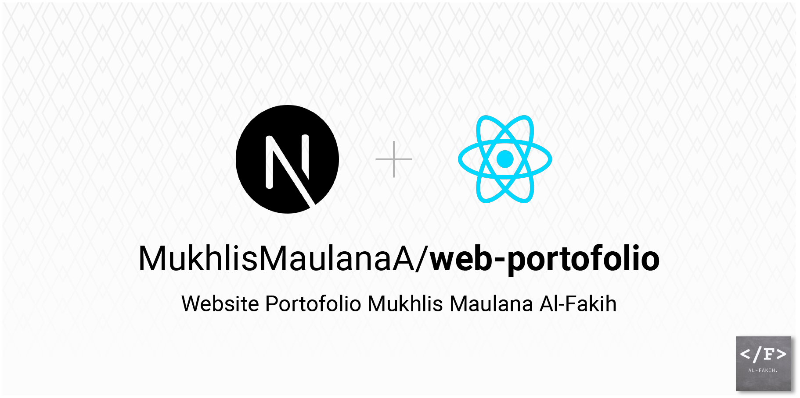
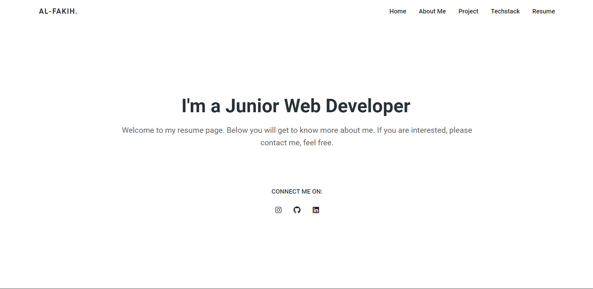
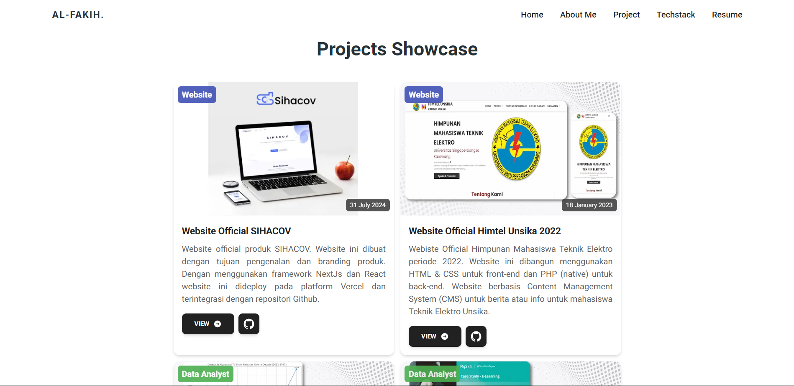

# 🚀 My Portfolio Website




> A modern and responsive portfolio website built using **Next.js**, **React.js**, and **TypeScript**, showcasing my work, skills, and resume.

🎉 **Live Site**: [View Portfolio](https://mukhlis-sooty.vercel.app/)

## ✨ Features

- **Hero Section**: Catchy intro with an eye-catching design.
- **About Section**: A brief overview of my background and experiences.
- **Tech Stack**: Showcase of the technologies I’m proficient in.
- **Projects Showcase**: Display of my notable projects with descriptions and links.
- **Resume**: Show Outline of my experience.

## 🚀 Tech Stack

This project leverages the following cutting-edge technologies:

- **[Next.js](https://nextjs.org/)**: A React framework with server-side rendering, static site generation, and more.
- **[React.js](https://reactjs.org/)**: A JavaScript library for building user interfaces, with component-based architecture.
- **[TypeScript](https://www.typescriptlang.org/)**: Type-safe JavaScript, enhancing developer productivity with static typing.
- **[Vercel](https://vercel.com/)**: Hosting platform for frontend frameworks, ensuring fast and reliable production deployments.

## 📂 Project Structure

```bash
├── components     # Reusable UI components
├── pages          # Next.js pages (each file here is a route)
│   ├── index.tsx  # Homepage (Hero, About, Projects, Resume sections)
│   └── _app.tsx   # Custom App component
├── public         # Static files (images, etc.)
├── styles         # CSS/SCSS files for styling
├── tsconfig.json  # TypeScript configuration
└── package.json   # Project dependencies and scripts
```

### Key Components

- **Hero.tsx**: The main entry point of the website, showcasing a captivating introduction.
- **About.tsx**: Displays personal information and a brief overview of background and expertise.
- **TechStack.tsx**: A visually appealing section for the technologies used and skills.
- **Projects.tsx**: Highlights major projects, each with a description and relevant links (e.g., GitHub, live demo).
- **Resume.tsx**: Section to highlight Outline my experience.

## 🛠 Installation & Setup

To get started with the project locally:

1. **Clone the repository**:
   ```bash
   git clone https://github.com/your-username/web-portofolio.git
   cd web-portofolio
   ```

2. **Install dependencies**:
   ```bash
   npm install
   ```

3. **Run the development server**:
   ```bash
   npm run dev
   ```
   The site will be live on `http://localhost:3000`.

4. **Build for production**:
   ```bash
   npm run build
   ```

5. **Start the production server**:
   ```bash
   npm start
   ```

## 🌐 Deployment

This portfolio website is hosted using **Vercel**. To deploy your own version, you can follow these steps:

1. **Fork or clone** this repository.
2. Push your changes to your own GitHub repository.
3. Connect your GitHub repository to [Vercel](https://vercel.com/).
4. Vercel will automatically build and deploy your project.

For more detailed instructions on deploying with Vercel, refer to the [Next.js Vercel documentation](https://nextjs.org/docs/deployment).

## 🎨 Design & UX

This portfolio emphasizes simplicity, responsiveness, and a clean design. It is fully responsive, ensuring that it works seamlessly on all screen sizes, from desktop to mobile.

### Screenshots
| Home Page                          | Projects Page                         |
|-------------------------------------|---------------------------------------|
|  |  |

## 🤝 Contributing

This is an open-source project, and contributions are welcome! To contribute:

1. Fork the repository.
2. Create a new branch with your feature/fix: `git checkout -b my-feature`.
3. Commit your changes: `git commit -m 'Add some feature'`.
4. Push the branch: `git push origin my-feature`.
5. Open a pull request to discuss and merge your changes.

## 📄 License

This project is licensed under the MIT License. See the [LICENSE](./LICENSE) file for details.

---

<p align="center">
Made with 💕 by <a href="https://github.com/MukhlisMaulanaA">Mukhlis Maulana Al-Fakih</a>
</p>

### **Key Highlights**:

- **Project Overview**: Provides a high-level description of the portfolio website, including its features.
- **Tech Stack**: Clearly outlines the key technologies used.
- **Installation Instructions**: Provides a step-by-step guide for setting up the project locally.
- **Deployment**: Details the Vercel deployment process to encourage users to deploy their own version.
- **Contributing**: Encourages open-source contributions with clear instructions.
- **License**: Included MIT license to make it legally sound for sharing and usage.
- **Badges**: Aesthetic and functional badges for the tech stack and hosting platform.
